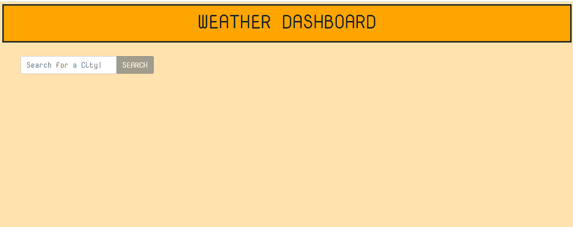
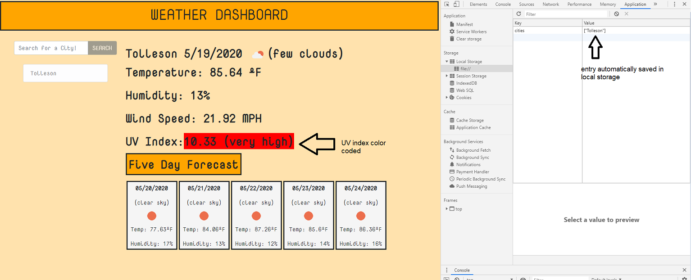
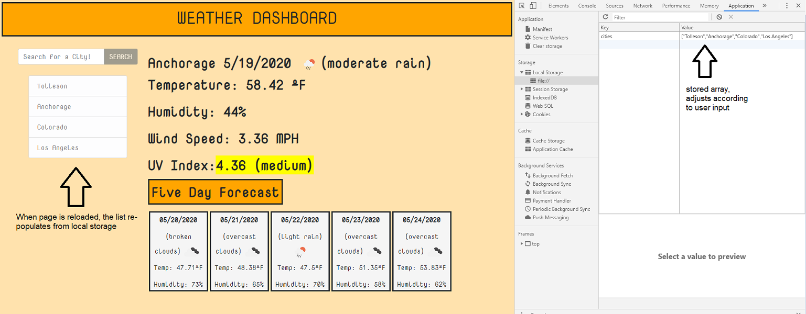

# hw-06-api-weather-gt
Homework 06 - API weather

## App Use

View the weather based on a city; when the city is entered in the search. It will produce the current weather, and a five-day forecast. The city entered is then placed on a list and saved in local storage. If the user reloads the page; the list searched before can be queried again.

## Screenshots

```
When the website is accessed, they are presented with the index page.
```


```
When the user enters a city on the search box, they are presented with the stats right away.
```


```
If user chooses to leave, the city list is stored in local storage and re-populated for use again.
```


## APIs used

[jQuery](https://https://learn.jquery.com/) |
[BootStrap](https://www.getbootstrap.com) |
[Open Weather](https://www.openweathermap.org/) |
[momentJs](https://momentjs.com/)

